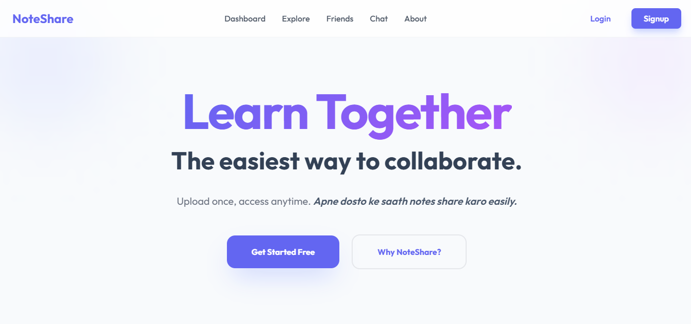
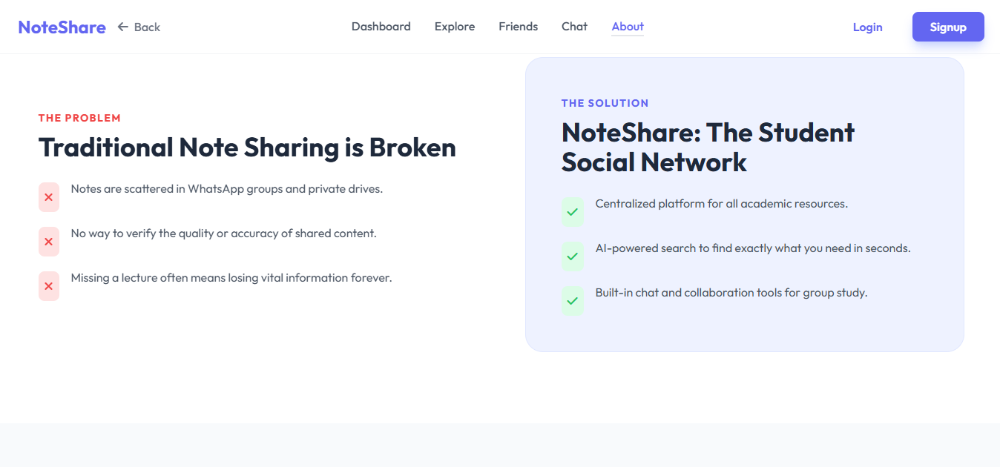
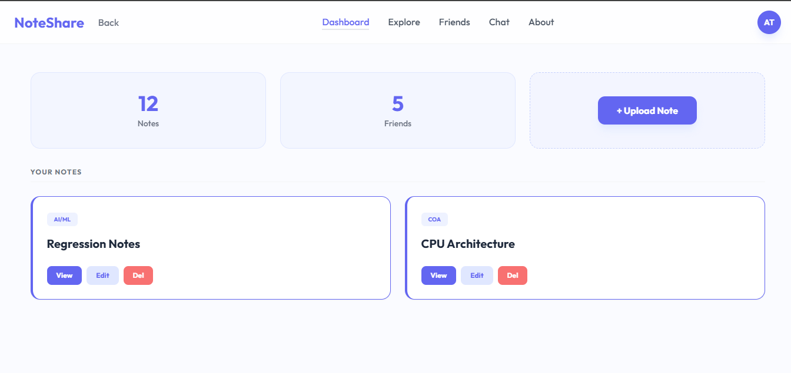
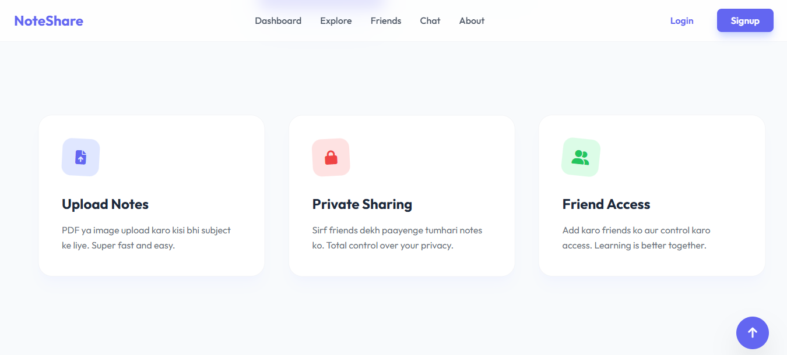
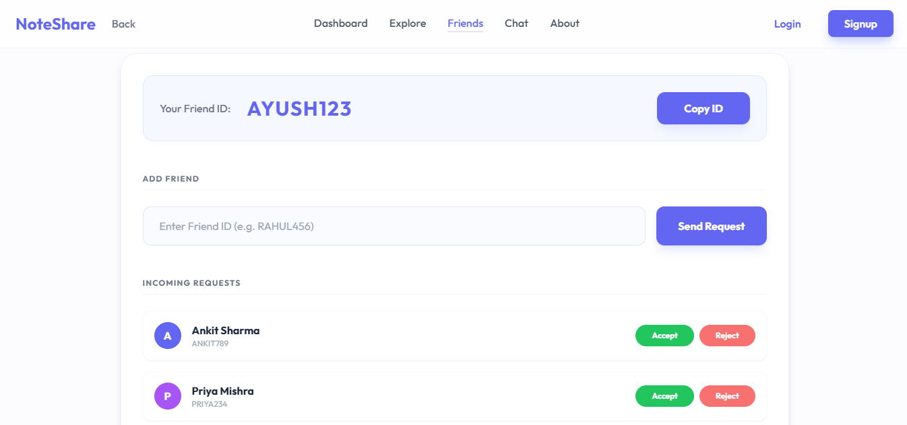
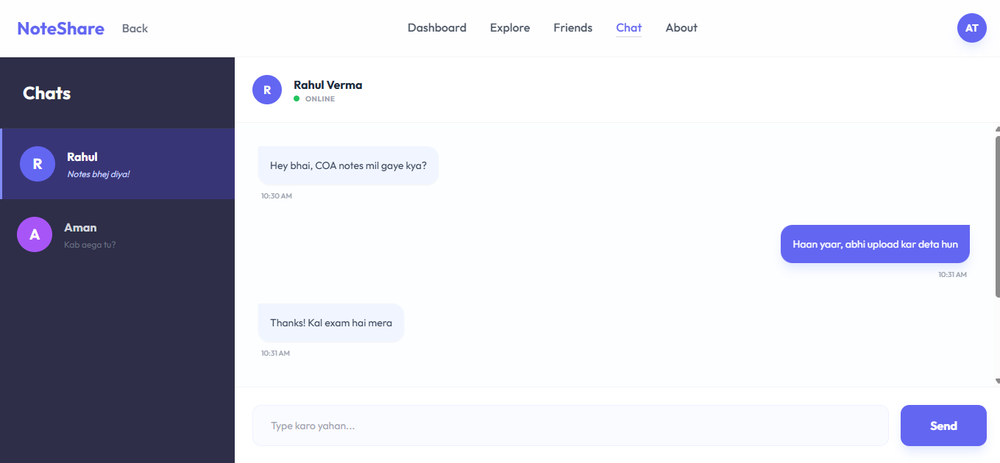
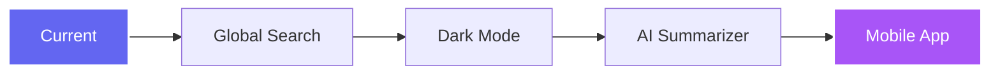
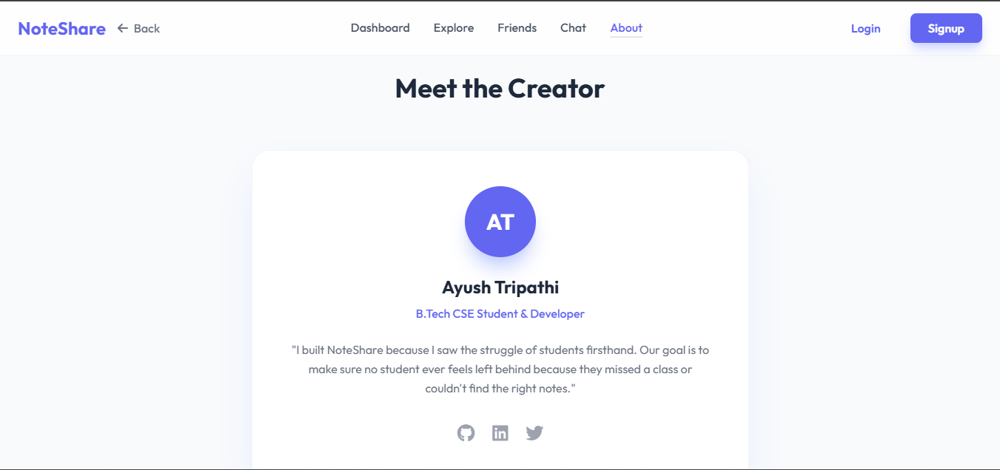

<p align="center">
  
</p>

<p align="center">
  
</p>

<p align="center">
  <a href="https://github.com/ayushtripathi-45/Note-Share">
    
  </a>
  <a href="https://github.com/ayushtripathi-45/Note-Share/network/members">
    
  </a>
  
  
</p>

<p align="center">
  
</p>

---

## 🌟 Overview
**NoteShare** is a premium, high-fidelity platform designed to revolutionize academic collaboration. It bridges the gap between static resource storage and dynamic social interaction, creating a seamless ecosystem for students to thrive.

> [!TIP]
> **Pro Tip:** NoteShare isn't just a drive—it's a community. Use the real-time chat to clarify doubts while browsing shared notes!

---

## 🔴 The Problem & ✅ The Solution

<p align="center">
  
</p>

<div align="center">

| ❌ The Problem | ✅ The Solution |
| :--- | :--- |
| Fragmented WhatsApp groups & messy drives | **Centralized, subject-wise organization** |
| Hidden or private resource access | **Friend-based controlled sharing** |
| Disconnected study & communication | **Integrated real-time chat interface** |

</div>

---

## ✨ Core Features

<details open>
<summary><b>🚀 Powerful Capabilities</b></summary>
<br>

- 📊 **Smart Dashboard**: A unified workspace for managing all your academic content.
- 💬 **Live Chat**: Connect instantly with peers to discuss concepts and share insights.
- 🤝 **Friend Ecosystem**: Build your network and share resources securely.
- 🔐 **Interactive Auth**: A sleek, togglable Login/Signup card with a premium feel.
- 🎭 **AOS Powered**: Beautiful scroll animations that make the UI feel alive.

</details>

### 🖼️ Visual Walkthrough

<div align="center">
  <table>
    <tr>
      <td width="50%">
        <h4 align="center">📊 Dashboard</h4>
        
      </td>
      <td width="50%">
        <h4 align="center">✨ Features</h4>
        
      </td>
    </tr>
    <tr>
      <td width="50%">
        <h4 align="center">🤝 Friends</h4>
        
      </td>
      <td width="50%">
        <h4 align="center">💬 Chat</h4>
        
      </td>
    </tr>
  </table>
</div>

---

## 🛠️ Technology Stack

<p align="center">
  
</p>

- **Frontend Core**: HTML5 & Vanilla JS (ES6+)
- **Design System**: [TailwindCSS](https://tailwindcss.com/) for modern, utility-first styling.
- **Motion Engine**: [AOS](https://michalsnik.github.io/aos/) for scroll-triggered magic.
- **Typography**: Outfit (via Google Fonts)
- **Visuals**: Font Awesome 6.4 & custom glassmorphism.

---

## 🚀 Future Roadmap



- [ ] **AI Summarizer**: Auto-generate bullet points from long PDF notes.
- [ ] **Smart OCR**: Convert handwritten images to searchable text.
- [ ] **Doubt Solver Bot**: Integrated AI to answer questions based on notes.
- [ ] **Night Owl Theme**: Optimized dark mode for late-night study sessions.

---

## 🛠️ Getting Started

```bash
# Clone the repository
git clone https://github.com/ayushtripathi-45/Note-Share.git

# Navigate to the folder
cd Note-Share

# Open in your browser (or use Live Server)
index.html
```

---

## 👨‍💻 Meet the Creator

<p align="center">
  
</p>

<p align="center">
  <a href="https://github.com/ayushtripathi-45">
    
  </a>
  <a href="https://linkedin.com/in/ayushtripathi">
    
  </a>
  <a href="https://twitter.com/ayushtripathi">
    
  </a>
</p>

<p align="center">
  Built with <b>Passion</b> and <b>Coffee</b> ☕ by <b>Ayush Tripathi</b>
</p>

<p align="center">
  
</p>
