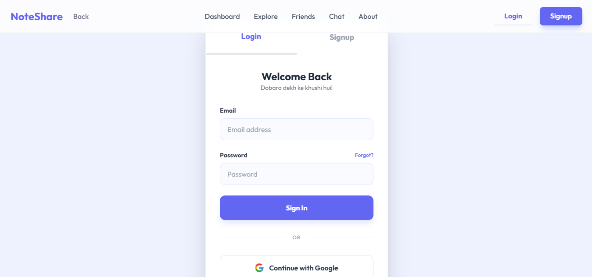
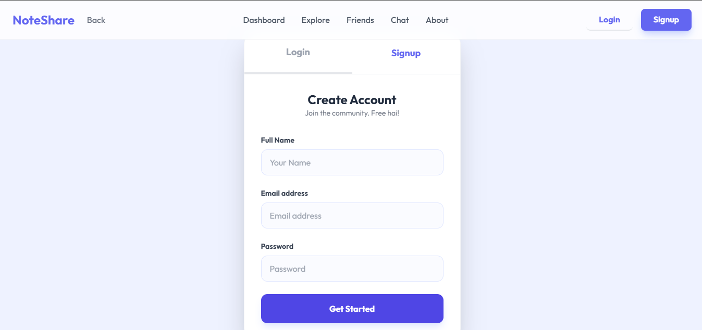

# 🚀 NoteShare — The Student Social Network

<p align="center">
  
</p>

<p align="center">
  
  
  
</p>

---

## 🌟 Overview
**NoteShare** is a high-fidelity, student-centric platform designed to revolutionize how academic resources are shared. It combines the utility of a cloud drive with the social connectivity of a modern chat application, ensuring that no student ever falls behind.

---

## 🔴 The Problem & ✅ The Solution

<p align="center">
  
</p>

> [!IMPORTANT]
> **The Problem:** Traditional note sharing is fragmented. WhatsApp groups are messy, private drives are hidden, and missing a lecture often means losing vital information forever.

> [!TIP]
> **The Solution:** NoteShare provides a centralized, secure, and intuitive ecosystem where notes are organized by subject, access is controlled by friendship, and collaboration happens in real-time.

---

## ✨ Core Features

| Feature | Description | Status |
| :--- | :--- | :--- |
| **Smart Dashboard** | A clean, full-width workspace for all your study materials. | ✅ Done |
| **Real-time Chat** | Discuss notes and concepts instantly with classmates. | ✅ Done |
| **Friend System** | Controlled sharing—only your approved friends can see your notes. | ✅ Done |
| **Modern Auth** | Sleek, togglable Login/Signup system with social integration. | ✅ Done |
| **AOS Animations** | Premium feel with smooth "Animate On Scroll" entrance effects. | ✅ Done |

### 🖼️ Visual Walkthrough

#### 📊 Dashboard & Note Management
<p align="center">
  
  
</p>

#### 🤝 Collaboration Tools
<p align="center">
  
  
</p>

#### 🔐 Secure Access
<p align="center">
  
  
</p>

---

## 🏗️ Project Structure

```bash
NoteShare/
├── index.html        # 🏠 Modern Landing Page with Typing Hero
├── dashboard.html    # 📊 Full-width Note Management Center
├── friends.html      # 🤝 Friend Request & ID Management
├── chat.html         # 💬 Real-time Style Chat Interface
├── auth.html         # 🔐 Interactive Login/Signup Card
├── about.html        # 📖 Mission & Story Page
├── assets/           # 🖼️ Project Screenshots & Media
├── script.js         # 🧠 Core Logic: Typing, Parallax, Toasts
└── style.css         # 🎨 Custom Styles & Design System
```

---

## 🛠️ Technology Stack

*   **Frontend:** HTML5, Vanilla JavaScript (ES6+)
*   **Styling:** [TailwindCSS](https://tailwindcss.com/) (Modern Utility-first CSS)
*   **Animations:** [AOS (Animate On Scroll)](https://michalsnik.github.io/aos/)
*   **Typography:** Google Fonts (Outfit)
*   **Icons:** Font Awesome 6.4

---

## 🚀 Future Roadmap

### 💎 General Enhancements
- [ ] **Global Search**: Find notes across the platform using smart filters.
- [ ] **Dark Mode**: A sleek "Midnight Study" theme for late-night sessions.
- [ ] **Mobile App**: Cross-platform Flutter app for on-the-go access.
- [ ] **Video Notes**: Support for short-form educational video clips.

### 🤖 Future AI Increments (Next-Gen)
- [ ] **AI Summarizer**: Automatically generate bullet-point summaries of uploaded PDF notes.
- [ ] **Smart OCR**: Extract text from handwritten images using AI.
- [ ] **Doubt Solver Bot**: An integrated AI assistant to answer questions based on shared notes.
- [ ] **Automated Flashcards**: AI-generated quiz questions to test your knowledge.

---

## 🛠️ Getting Started

1. **Clone the repo:** `git clone https://github.com/yourusername/noteshare.git`
2. **Open `index.html`** in your browser.
3. **Experience the magic!** ✨

---

## 👨‍💻 Meet the Creator

<p align="center">
  
</p>

<p align="center">
  Built with ❤️ for students by <b>Ayush Tripathi</b>
</p>
